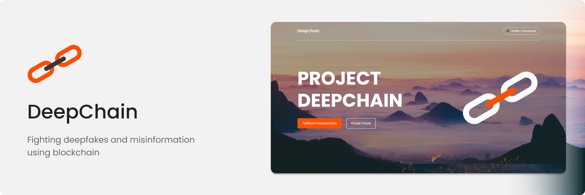

# DeepChain &middot;   

## The problem DeepChain solves
With the rise in social media and the ever-increasing demand for it, there remains no single source of news.

Most of the news, videos and images we receive are manipulated deliberately. And this is done mostly by changing the content, context and intent of the news. There is no way to know if we are watching the video or reading the news that we were intended to watch or read. The advancement in deep learning gave rise to deep fakes, which is nothing but Artificial Intelligence making some fake videos. Deepfake technology creates convincing but entirely fake videos and photos from scratch.

And in order to combat this, we came up with an idea called DeepChain which intends to allow the user to confirm the publishing source and confirm that it has not been altered at any point in time.

This platform could be used by the publishing houses, the government for their official announcement as well as normal users.

## Working of DeepChain
If anyone wants to sign any piece of information like a video, an image or an audio file, they can upload it to IPFS. Since IPFS doesn’t store any metadata of the file, we made a smart contract which signs a transaction containing the Content Identifier of the file uploaded to IPFS. This creates a proof-of-chain about the person of the publication house reporting and timestamping it and proof-of-origin of the content.

You can then share the transaction hash and anyone can verify the information by looking at the URI of the media from IPFS and then can retrieve the original message.

## Challenges we ran into
There were two main challenges we are into while developing DeepChain
Integration with Biconomy: we initially planned to integrate Biconomy to relieve the gas fee for the users, but when developing the solution we noticed that the data field in the transaction was corrupted for unknown reasons. We add the hex of IPFS CID in the data field which could be retrieved by third parties in order to obtain the original content
As a part of our plan, the smart contract that we perform the transaction to, the EVM fails the transaction, this is due to a check condition in the Metamask wallet. https://github.com/MetaMask/metamask-extension/issues/8001 .

## Technologies we used
Metamask, Fleek, IPFS, Pinata, Vue, GSAP, SCSS

## Run the project
Run the `npm install` command in the terminal to download the dependencies.   
Run the `npm run serve` command to run the vue project in the development mode. 

Open http://localhost:8080 to view it in the browser.
The page will reload if you make edits.