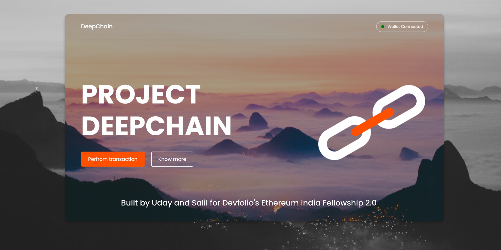

# DeepChain &middot;  [](LICENSE) [](README.md) [](https://app.netlify.com/sites/css-art-gallery/deploys)





## Run the project
Run the `yarn install` command in the terminal to download the dependencies.   
Run the `yarn start` command to run the project in the development mode. 

Open http://localhost:3000 to view it in the browser.
The page will reload if you make edits.

# deepchain

## Project setup
```
npm install
```

### Compiles and hot-reloads for development
```
npm run serve
```

### Compiles and minifies for production
```
npm run build
```

### Lints and fixes files
```
npm run lint
```

### Customize configuration
See [Configuration Reference](https://cli.vuejs.org/config/).
# deepchain
